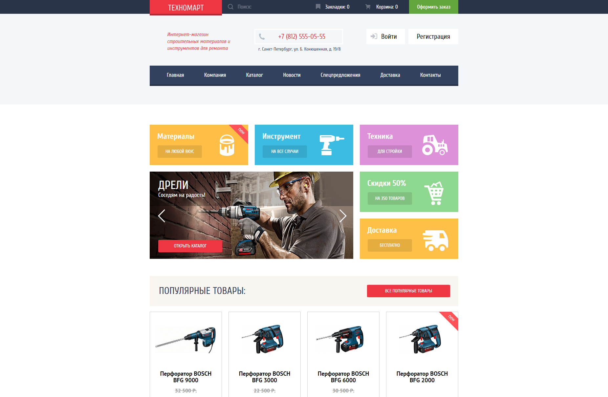

# HTML и CSS. Профессиональная вёрстка сайтов.

### 📋 Учебный проект «Техномарт» (26.01.2020)
### 🏅 Проект успешно защищён что подтверждается <a href="https://drive.google.com/file/d/1ZInsugvmrFhaDh-7torCprT8Xtz7dIky/view?usp=drive_link" target="_blank">сертификатом</a>.

🔗 URL: <a href="https://technomart-arshtnkv.vercel.app/" target="_blank">technomart-arshtnkv.vercel.app</a>
* Студент: [Антон Решетников](https://up.htmlacademy.ru/htmlcss/27/user/1263227).
* Наставник: Степан Куркин.

 

  

### 🛠 Технологии:
- HTML
- CSS

### 💡 Описание:
В рамках этого проекта я научился профессионально верстать и стилизовать сайты. 
А именно:
- Создавать семантичную, доступную и выразительную разметку страниц проектов по макету.
- Экспортировать графику из макета.
- Строить крупные и мелкие сетки страниц с помощью флексов.
- Строить мелкие сетки компонентов страниц при помощи гридов.
- Добавлять на страницы проектов мелкие декоративные и иконочные графические элементы. Стилизовать текстовые блоки, декоративные элементы внутри сеток компонентов, кнопки и ссылки.
- Создавать всплывающие элементы.
- Разобрали приёмы стилизации форм и их элементов.
- Рассмотрели состояния и позиционирование элементов на странице.

